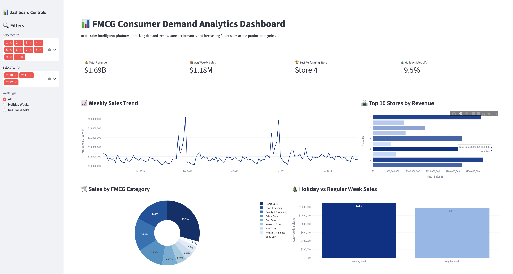
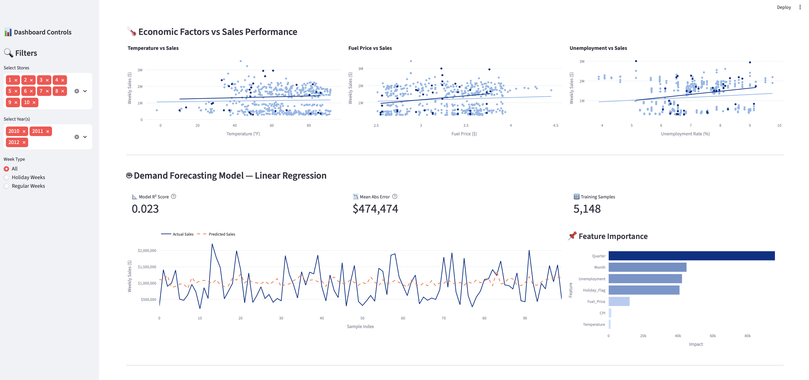
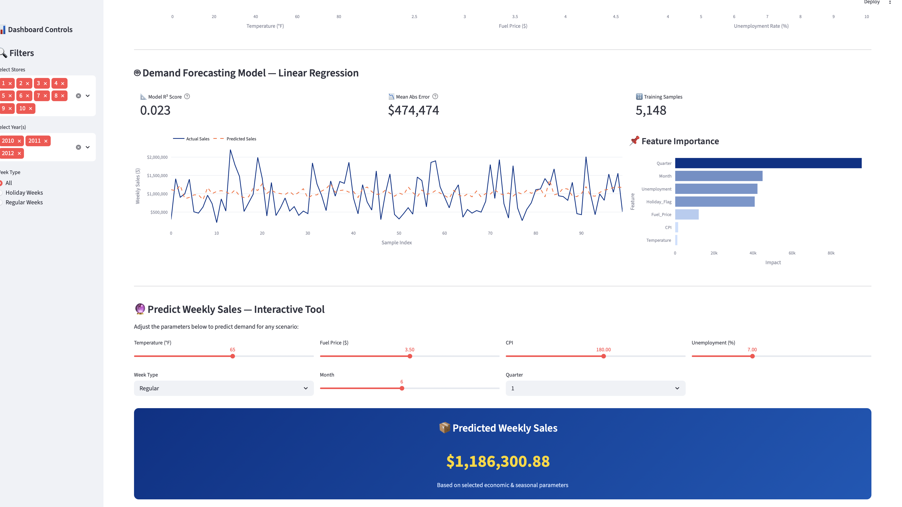
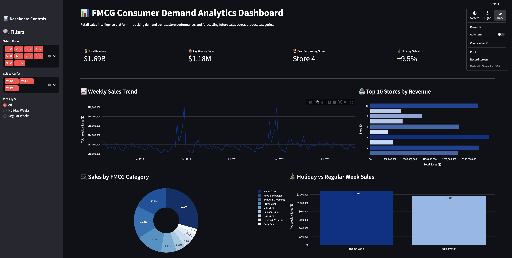
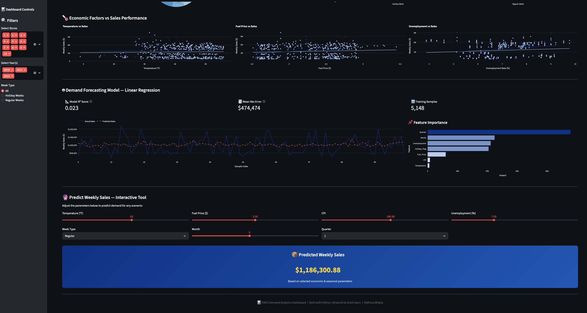

# FMCG Consumer Demand Analytics Dashboard

A retail sales intelligence platform built to analyse demand trends, store performance, and forecast future sales across FMCG product categories — simulating the kind of data-driven decision-making tools used by consumer goods companies like P&G and Walmart.

## What It Does

- **Sales Trend Analysis** — weekly revenue trends across 45 stores over 3 years
- **Store Performance** — top performing stores ranked by total revenue
- **FMCG Category Breakdown** — revenue distribution across product categories (Home Care, Beauty, Health, Food etc.)
- **Holiday Impact Analysis** — quantifies sales lift during holiday weeks vs regular weeks
- **Economic Factor Correlation** — analyses impact of temperature, fuel prices, CPI, and unemployment on sales
- **Demand Forecasting (ML)** — linear regression model predicting weekly sales with R² score and MAE metrics
- **Interactive Predictor** — real-time sales prediction tool adjustable by economic and seasonal parameters


## Screenshots







## Tech Stack

- **Python** — core language
- **Pandas & NumPy** — data processing and analysis
- **Scikit-learn** — linear regression forecasting model
- **Plotly** — interactive visualisations
- **Streamlit** — web dashboard framework

##  How to Run

```bash
# Clone the repo
git clone https://github.com/yourusername/fmcg-demand-analytics

# Install dependencies
pip install -r requirements.txt

# Run the dashboard
streamlit run app.py
```

##  Dataset

Walmart retail sales dataset — 6,435 weekly sales records across 45 stores (2010–2012), including economic indicators (CPI, fuel price, unemployment, temperature).

##  Key Insights

- Holiday weeks show a measurable lift in average weekly sales
- Temperature and unemployment rate correlate negatively with sales performance
- The forecasting model identifies CPI and fuel price as the strongest demand drivers
